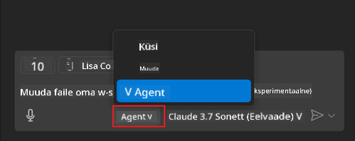
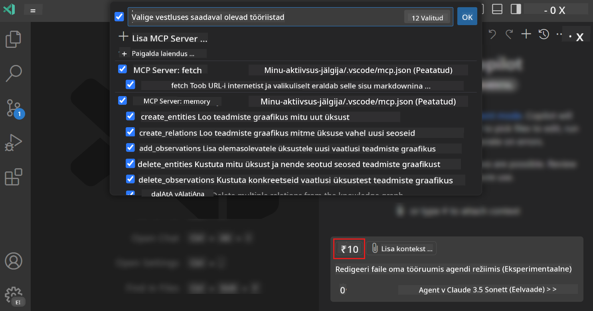
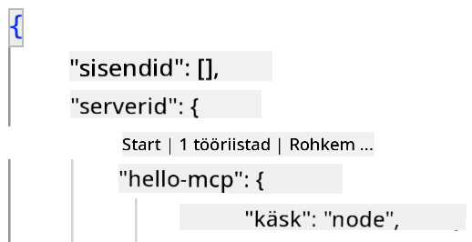
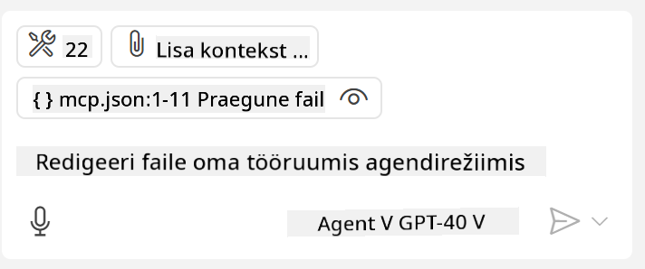
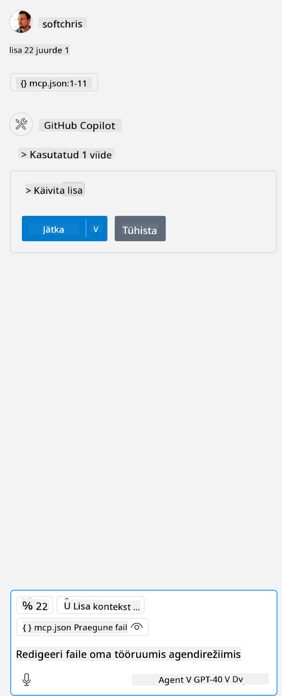

<!--
CO_OP_TRANSLATOR_METADATA:
{
  "original_hash": "d940b5e0af75e3a3a4d1c3179120d1d9",
  "translation_date": "2025-10-11T11:33:23+00:00",
  "source_file": "03-GettingStarted/04-vscode/README.md",
  "language_code": "et"
}
-->
# GitHub Copilot Agent režiimis serveri kasutamine

Visual Studio Code ja GitHub Copilot võivad toimida kliendina ja kasutada MCP serverit. Miks me seda teha tahaksime, võite küsida? Noh, see tähendab, et kõik MCP serveri funktsioonid on nüüd saadaval otse teie IDE-s. Kujutage ette, et lisate näiteks GitHubi MCP serveri – see võimaldaks GitHubi juhtimist loomuliku keele kaudu, ilma et peaksite terminalis konkreetseid käske sisestama. Või kujutage ette midagi, mis üldiselt parandaks teie arendajakogemust, kõik juhitav loomuliku keele abil. Nüüd hakkate mõistma, miks see on kasulik, eks?

## Ülevaade

See õppetund käsitleb, kuidas kasutada Visual Studio Code'i ja GitHub Copiloti Agent režiimi kliendina teie MCP serveri jaoks.

## Õpieesmärgid

Selle õppetunni lõpuks suudate:

- Kasutada MCP serverit Visual Studio Code'i kaudu.
- Käivitada tööriistu ja muid funktsioone GitHub Copiloti abil.
- Konfigureerida Visual Studio Code'i, et leida ja hallata oma MCP serverit.

## Kasutamine

Te saate oma MCP serverit juhtida kahel erineval viisil:

- Kasutajaliidese kaudu – seda näete hiljem selles peatükis.
- Terminali kaudu – asju on võimalik juhtida terminalist, kasutades `code` käivitatavat faili:

  MCP serveri lisamiseks oma kasutajaprofiilile kasutage käsurea valikut --add-mcp ja esitage JSON serveri konfiguratsioon kujul {\"name\":\"server-name\",\"command\":...}.

  ```
  code --add-mcp "{\"name\":\"my-server\",\"command\": \"uvx\",\"args\": [\"mcp-server-fetch\"]}"
  ```

### Ekraanipildid





Räägime järgnevates osades rohkem sellest, kuidas kasutada visuaalset liidest.

## Lähenemine

Siin on üldine lähenemine:

- Konfigureerige fail, et leida oma MCP server.
- Käivitage/ühendage serveriga, et näha selle funktsioone.
- Kasutage neid funktsioone GitHub Copiloti vestlusliidese kaudu.

Suurepärane, nüüd kui me mõistame protsessi, proovime MCP serverit kasutada Visual Studio Code'i kaudu harjutuse abil.

## Harjutus: Serveri kasutamine

Selles harjutuses konfigureerime Visual Studio Code'i, et leida teie MCP server, nii et seda saab kasutada GitHub Copiloti vestlusliidese kaudu.

### -0- Eeltoiming: MCP serverite avastamise lubamine

Teil võib olla vaja lubada MCP serverite avastamine.

1. Minge Visual Studio Code'is `File -> Preferences -> Settings`.

1. Otsige "MCP" ja lubage `chat.mcp.discovery.enabled` settings.json failis.

### -1- Konfiguratsioonifaili loomine

Alustage konfiguratsioonifaili loomisega oma projekti juurkausta. Teil on vaja faili nimega MCP.json, mis tuleb paigutada kausta .vscode. See peaks välja nägema järgmiselt:

```text
.vscode
|-- mcp.json
```

Järgmisena vaatame, kuidas lisada serveri kirje.

### -2- Serveri konfigureerimine

Lisage järgmine sisu *mcp.json* faili:

```json
{
    "inputs": [],
    "servers": {
       "hello-mcp": {
           "command": "node",
           "args": [
               "build/index.js"
           ]
       }
    }
}
```

Ülaltoodud näide näitab, kuidas käivitada server Node.js-is. Teiste käituskeskkondade jaoks määrake sobiv käsk serveri käivitamiseks, kasutades `command` ja `args`.

### -3- Serveri käivitamine

Kui olete kirje lisanud, käivitage server:

1. Leidke oma kirje *mcp.json* failis ja veenduge, et näete "play" ikooni:

    

1. Klõpsake "play" ikooni. Peaksite nägema, et GitHub Copiloti vestlusliidese tööriistade ikoonil suureneb saadaval olevate tööriistade arv. Kui klõpsate tööriistade ikoonil, näete registreeritud tööriistade loendit. Saate iga tööriista sisse/välja lülitada, sõltuvalt sellest, kas soovite, et GitHub Copilot neid kontekstis kasutaks:

  

1. Tööriista käivitamiseks sisestage käsk, mis vastab ühe teie tööriista kirjeldusele, näiteks käsk "add 22 to 1":

  

  Peaksite nägema vastust, mis ütleb 23.

## Ülesanne

Proovige lisada serveri kirje oma *mcp.json* faili ja veenduge, et saate serveri käivitada/peatada. Veenduge, et saate suhelda serveri tööriistadega GitHub Copiloti vestlusliidese kaudu.

## Lahendus

[Lahendus](./solution/README.md)

## Olulised punktid

Selle peatüki olulised punktid on järgmised:

- Visual Studio Code on suurepärane klient, mis võimaldab kasutada mitmeid MCP servereid ja nende tööriistu.
- GitHub Copiloti vestlusliides on viis, kuidas serveritega suhelda.
- Saate küsida kasutajalt sisendeid, nagu API võtmed, mida saab MCP serverile edastada serveri kirje konfigureerimisel *mcp.json* failis.

## Näited

- [Java kalkulaator](../samples/java/calculator/README.md)
- [.Net kalkulaator](../../../../03-GettingStarted/samples/csharp)
- [JavaScript kalkulaator](../samples/javascript/README.md)
- [TypeScript kalkulaator](../samples/typescript/README.md)
- [Python kalkulaator](../../../../03-GettingStarted/samples/python)

## Lisamaterjalid

- [Visual Studio dokumentatsioon](https://code.visualstudio.com/docs/copilot/chat/mcp-servers)

## Mis edasi?

- Järgmine: [Stdio serveri loomine](../05-stdio-server/README.md)

---

**Lahtiütlus**:  
See dokument on tõlgitud AI tõlketeenuse [Co-op Translator](https://github.com/Azure/co-op-translator) abil. Kuigi püüame tagada täpsust, palume arvestada, et automaatsed tõlked võivad sisaldada vigu või ebatäpsusi. Algne dokument selle algses keeles tuleks pidada autoriteetseks allikaks. Olulise teabe puhul soovitame kasutada professionaalset inimtõlget. Me ei vastuta selle tõlke kasutamisest tulenevate arusaamatuste või valesti tõlgenduste eest.