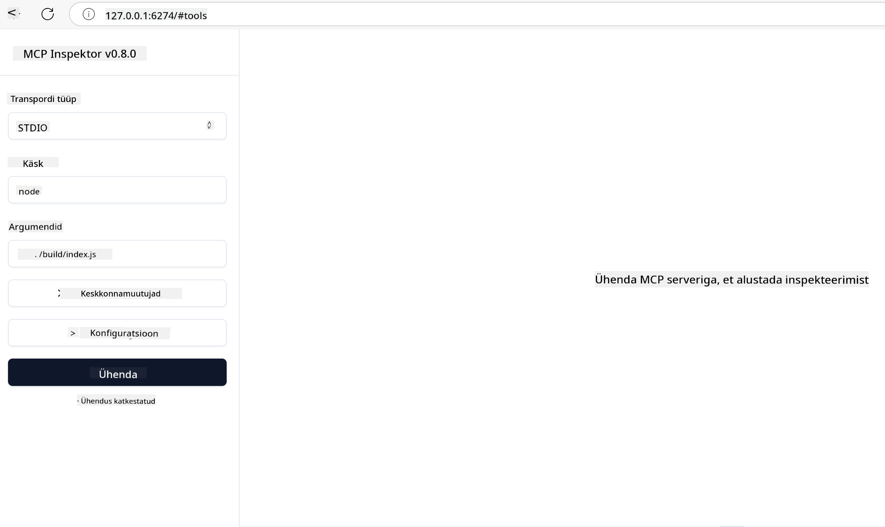

<!--
CO_OP_TRANSLATOR_METADATA:
{
  "original_hash": "4e34e34e84f013e73c7eaa6d09884756",
  "translation_date": "2025-10-11T11:57:01+00:00",
  "source_file": "03-GettingStarted/08-testing/README.md",
  "language_code": "et"
}
-->
## Testimine ja silumine

Enne kui alustate oma MCP serveri testimist, on oluline mõista olemasolevaid tööriistu ja parimaid praktikaid silumiseks. Tõhus testimine tagab, et teie server käitub ootuspäraselt, ning aitab teil kiiresti tuvastada ja lahendada probleeme. Järgmises osas tutvustatakse soovitatud lähenemisviise MCP rakenduse valideerimiseks.

## Ülevaade

See õppetund käsitleb, kuidas valida õige testimislähenemine ja kõige tõhusam testimistööriist.

## Õpieesmärgid

Selle õppetunni lõpuks suudate:

- Kirjeldada erinevaid testimislähenemisi.
- Kasutada erinevaid tööriistu oma koodi tõhusaks testimiseks.

## MCP serverite testimine

MCP pakub tööriistu, mis aitavad teil servereid testida ja siluda:

- **MCP Inspector**: Käsurea tööriist, mida saab kasutada nii CLI kui ka visuaalse tööriistana.
- **Manuaalne testimine**: Võite kasutada tööriista nagu curl veebipäringute tegemiseks, kuid sobib iga HTTP-päringuid toetav tööriist.
- **Üksustestimine**: Võimalik on kasutada oma eelistatud testimisraamistikku nii serveri kui kliendi funktsioonide testimiseks.

### MCP Inspectori kasutamine

Oleme selle tööriista kasutamist varasemates õppetundides kirjeldanud, kuid räägime sellest nüüd üldisemalt. See on Node.js-is loodud tööriist, mida saab kasutada `npx` käskluse abil. See laadib tööriista ajutiselt alla ja installib ning eemaldab selle pärast päringu täitmist.

[MCP Inspector](https://github.com/modelcontextprotocol/inspector) aitab teil:

- **Avastada serveri võimalusi**: Tuvastada automaatselt saadaolevaid ressursse, tööriistu ja juhiseid.
- **Testida tööriistade täitmist**: Proovida erinevaid parameetreid ja näha vastuseid reaalajas.
- **Vaadata serveri metaandmeid**: Uurida serveri infot, skeeme ja konfiguratsioone.

Tüüpiline tööriista käivitamine näeb välja selline:

```bash
npx @modelcontextprotocol/inspector node build/index.js
```

Ülaltoodud käsk käivitab MCP ja selle visuaalse liidese ning avab teie brauseris kohaliku veebiliidese. Võite näha armatuurlauda, mis kuvab teie registreeritud MCP serverid, nende saadaolevad tööriistad, ressursid ja juhised. Liides võimaldab teil interaktiivselt testida tööriistade täitmist, uurida serveri metaandmeid ja vaadata reaalajas vastuseid, muutes MCP serveri rakenduste valideerimise ja silumise lihtsamaks.

Siin on näide, kuidas see välja näeb: 

Seda tööriista saab käivitada ka CLI režiimis, lisades `--cli` atribuudi. Näide tööriista käivitamisest "CLI" režiimis, mis loetleb kõik serveri tööriistad:

```sh
npx @modelcontextprotocol/inspector --cli node build/index.js --method tools/list
```

### Manuaalne testimine

Lisaks Inspectori tööriista kasutamisele serveri võimaluste testimiseks on sarnane lähenemine HTTP-päringuid toetava kliendi, näiteks curl, kasutamine.

Curli abil saate MCP servereid testida otse HTTP-päringutega:

```bash
# Example: Test server metadata
curl http://localhost:3000/v1/metadata

# Example: Execute a tool
curl -X POST http://localhost:3000/v1/tools/execute \
  -H "Content-Type: application/json" \
  -d '{"name": "calculator", "parameters": {"expression": "2+2"}}'
```

Nagu ülaltoodud curli näitest näha, kasutatakse POST-päringut tööriista käivitamiseks, kasutades tööriista nime ja selle parameetritega sisendit. Kasutage lähenemist, mis teile kõige paremini sobib. CLI tööriistad on üldiselt kiiremad ja võimaldavad skriptimist, mis võib olla kasulik CI/CD keskkonnas.

### Üksustestimine

Looge oma tööriistade ja ressursside jaoks üksustestid, et tagada nende korrektne toimimine. Siin on näide testimiskoodist.

```python
import pytest

from mcp.server.fastmcp import FastMCP
from mcp.shared.memory import (
    create_connected_server_and_client_session as create_session,
)

# Mark the whole module for async tests
pytestmark = pytest.mark.anyio


async def test_list_tools_cursor_parameter():
    """Test that the cursor parameter is accepted for list_tools.

    Note: FastMCP doesn't currently implement pagination, so this test
    only verifies that the cursor parameter is accepted by the client.
    """

 server = FastMCP("test")

    # Create a couple of test tools
    @server.tool(name="test_tool_1")
    async def test_tool_1() -> str:
        """First test tool"""
        return "Result 1"

    @server.tool(name="test_tool_2")
    async def test_tool_2() -> str:
        """Second test tool"""
        return "Result 2"

    async with create_session(server._mcp_server) as client_session:
        # Test without cursor parameter (omitted)
        result1 = await client_session.list_tools()
        assert len(result1.tools) == 2

        # Test with cursor=None
        result2 = await client_session.list_tools(cursor=None)
        assert len(result2.tools) == 2

        # Test with cursor as string
        result3 = await client_session.list_tools(cursor="some_cursor_value")
        assert len(result3.tools) == 2

        # Test with empty string cursor
        result4 = await client_session.list_tools(cursor="")
        assert len(result4.tools) == 2
    
```

Eelnev kood teeb järgmist:

- Kasutab pytest raamistikku, mis võimaldab luua teste funktsioonidena ja kasutada assert-lauseid.
- Loob MCP serveri kahe erineva tööriistaga.
- Kasutab `assert` lauset, et kontrollida, kas teatud tingimused on täidetud.

Vaadake [täielikku faili siin](https://github.com/modelcontextprotocol/python-sdk/blob/main/tests/client/test_list_methods_cursor.py)

Antud faili abil saate testida oma serverit, et tagada, et võimalused luuakse ootuspäraselt.

Kõik suuremad SDK-d sisaldavad sarnaseid testimisjaotisi, nii et saate kohandada oma valitud käitusajaga.

## Näited

- [Java kalkulaator](../samples/java/calculator/README.md)
- [.Net kalkulaator](../../../../03-GettingStarted/samples/csharp)
- [JavaScript kalkulaator](../samples/javascript/README.md)
- [TypeScript kalkulaator](../samples/typescript/README.md)
- [Python kalkulaator](../../../../03-GettingStarted/samples/python) 

## Lisamaterjalid

- [Python SDK](https://github.com/modelcontextprotocol/python-sdk)

## Mis edasi?

- Järgmine: [Paigaldamine](../09-deployment/README.md)

---

**Vastutusest loobumine**:  
See dokument on tõlgitud AI tõlketeenuse [Co-op Translator](https://github.com/Azure/co-op-translator) abil. Kuigi püüame tagada täpsust, palume arvestada, et automaatsed tõlked võivad sisaldada vigu või ebatäpsusi. Algne dokument selle algses keeles tuleks pidada autoriteetseks allikaks. Olulise teabe puhul soovitame kasutada professionaalset inimtõlget. Me ei vastuta arusaamatuste või valesti tõlgenduste eest, mis võivad tekkida selle tõlke kasutamise tulemusena.