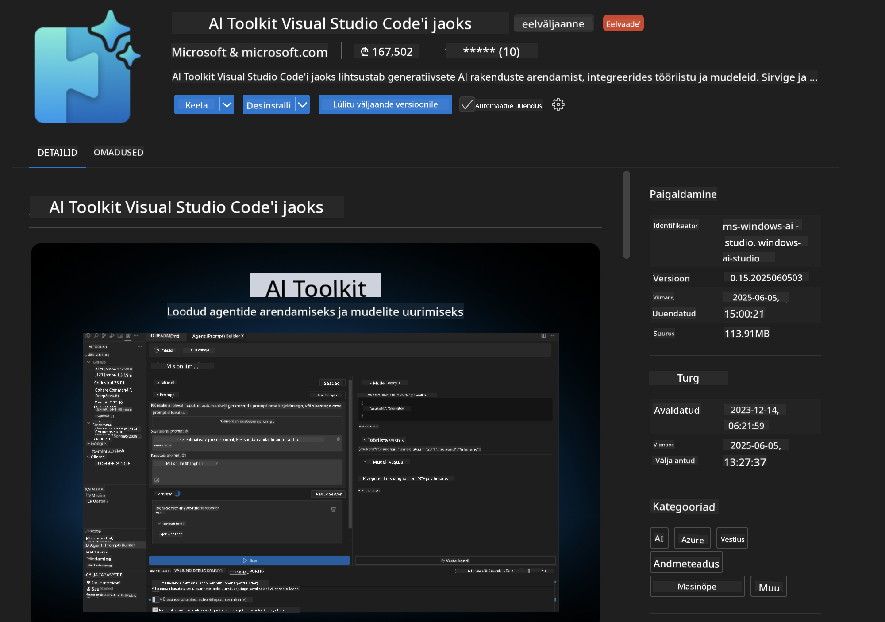
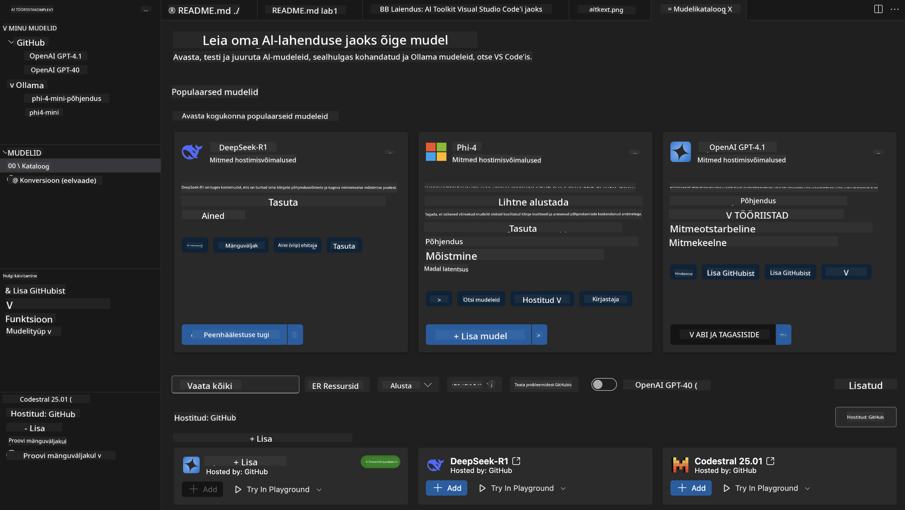
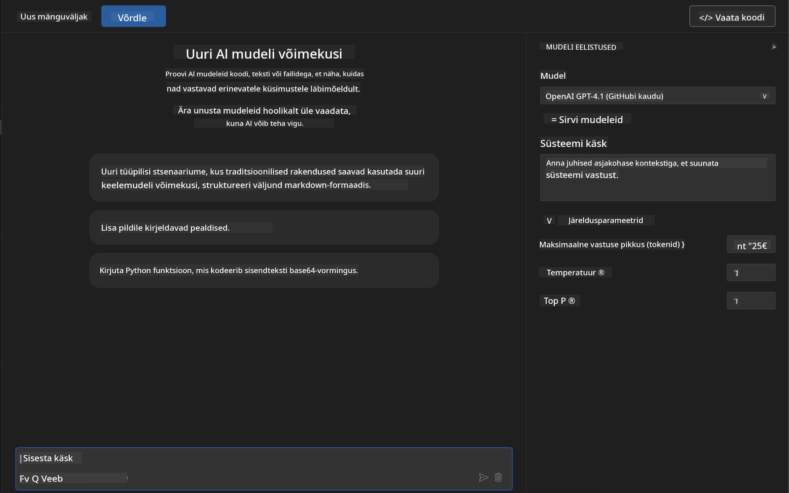
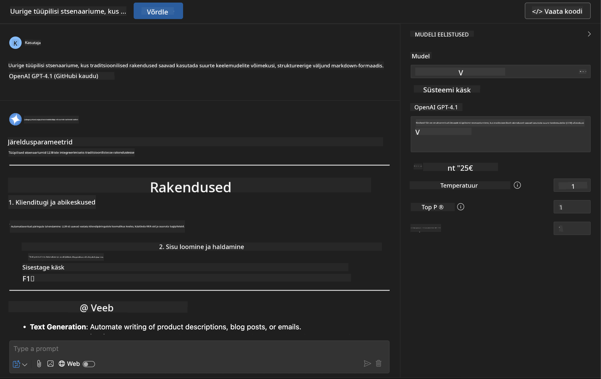
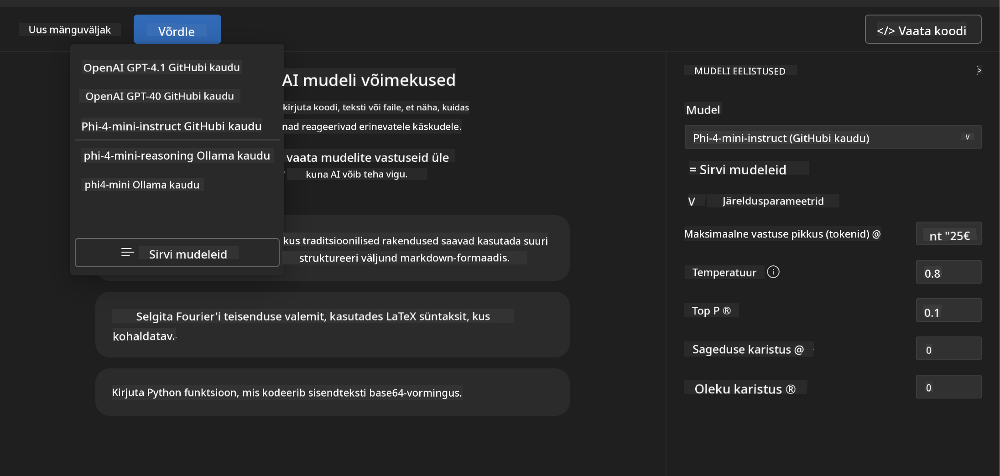
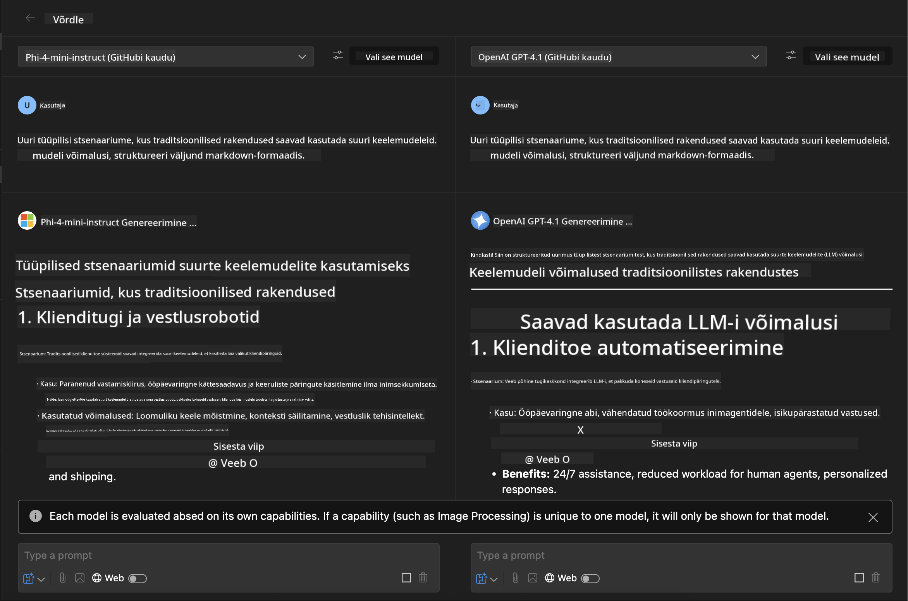
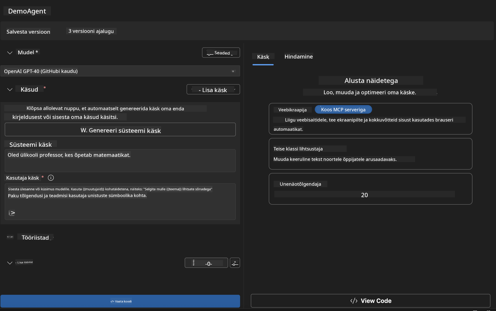
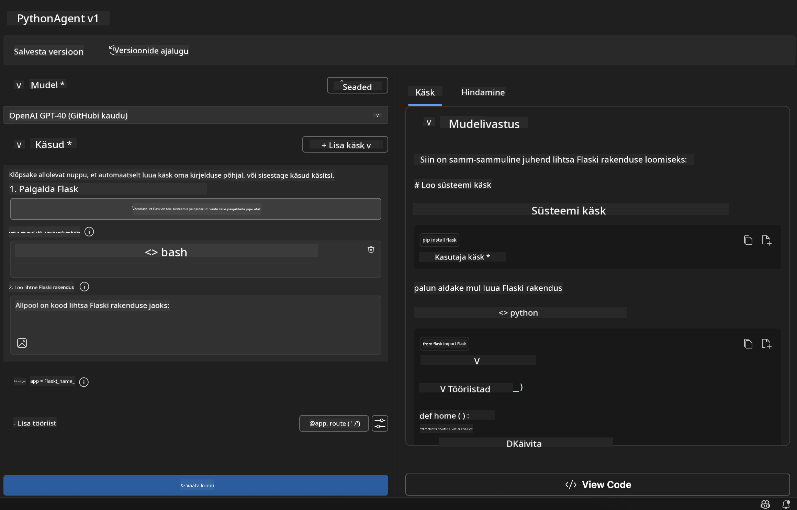

<!--
CO_OP_TRANSLATOR_METADATA:
{
  "original_hash": "2aa9dbc165e104764fa57e8a0d3f1c73",
  "translation_date": "2025-10-11T11:28:19+00:00",
  "source_file": "10-StreamliningAIWorkflowsBuildingAnMCPServerWithAIToolkit/lab1/README.md",
  "language_code": "et"
}
-->
# 🚀 Moodul 1: AI Toolkit'i põhialused

[]()
[]()
[]()

## 📋 Õpieesmärgid

Selle mooduli lõpuks oskad:
- ✅ Installida ja seadistada AI Toolkit'i Visual Studio Code'i jaoks
- ✅ Navigeerida mudelikataloogis ja mõista erinevaid mudelite allikaid
- ✅ Kasutada Playground'i mudelite testimiseks ja katsetamiseks
- ✅ Luua kohandatud AI agente Agent Builder'i abil
- ✅ Võrrelda mudelite jõudlust erinevate pakkujate vahel
- ✅ Rakendada parimaid praktikaid promptide koostamisel

## 🧠 Sissejuhatus AI Toolkit'i (AITK)

**AI Toolkit for Visual Studio Code** on Microsofti juhtiv laiendus, mis muudab VS Code'i terviklikuks AI arenduskeskkonnaks. See ühendab AI uurimistöö praktilise rakenduse arendamisega, muutes generatiivse AI kättesaadavaks igasuguse tasemega arendajatele.

### 🌟 Põhivõimalused

| Funktsioon | Kirjeldus | Kasutusjuht |
|------------|-----------|-------------|
| **🗂️ Mudelikataloog** | Juurdepääs enam kui 100 mudelile GitHubist, ONNXist, OpenAI-st, Anthropicust, Google'ist | Mudelite avastamine ja valik |
| **🔌 BYOM tugi** | Integreeri oma mudelid (kohalik/kaug) | Kohandatud mudelite juurutamine |
| **🎮 Interaktiivne Playground** | Reaalajas mudelite testimine vestlusliidese abil | Kiire prototüüpimine ja testimine |
| **📎 Multimodaalne tugi** | Töötle teksti, pilte ja manuseid | Keerukad AI rakendused |
| **⚡ Partii töötlemine** | Käivita mitu prompti samaaegselt | Tõhusad testimisvood |
| **📊 Mudelite hindamine** | Sisseehitatud mõõdikud (F1, asjakohasus, sarnasus, koherentsus) | Jõudluse hindamine |

### 🎯 Miks AI Toolkit on oluline

- **🚀 Kiirendatud arendus**: Ideest prototüübini minutitega
- **🔄 Ühtne töövoog**: Üks liides mitme AI pakkuja jaoks
- **🧪 Lihtne katsetamine**: Võrdle mudeleid ilma keeruka seadistuseta
- **📈 Valmis tootmiseks**: Sujuv üleminek prototüübist juurutamiseni

## 🛠️ Eeltingimused ja seadistamine

### 📦 AI Toolkit'i laienduse installimine

**Samm 1: Juurdepääs laienduste turule**
1. Ava Visual Studio Code
2. Navigeeri laienduste vaatesse (`Ctrl+Shift+X` või `Cmd+Shift+X`)
3. Otsi "AI Toolkit"

**Samm 2: Vali versioon**
- **🟢 Release**: Soovitatav tootmiskasutuseks
- **🔶 Pre-release**: Varajane juurdepääs uusimatele funktsioonidele

**Samm 3: Installi ja aktiveeri**



### ✅ Kontroll-loend
- [ ] AI Toolkit'i ikoon ilmub VS Code'i külgribale
- [ ] Laiendus on lubatud ja aktiveeritud
- [ ] Installimisvigu ei esine väljundpaneelil

## 🧪 Praktiline harjutus 1: GitHubi mudelite uurimine

**🎯 Eesmärk**: Valda mudelikataloogi ja testi oma esimest AI mudelit

### 📊 Samm 1: Navigeeri mudelikataloogis

Mudelikataloog on sinu värav AI ökosüsteemi. See koondab mudeleid mitmelt pakkujalt, muutes valikute avastamise ja võrdlemise lihtsaks.

**🔍 Navigeerimisjuhend:**

Klõpsa **MODELS - Catalog** AI Toolkit'i külgribal



**💡 Näpunäide**: Otsi mudeleid, millel on spetsiifilised võimed, mis sobivad sinu kasutusjuhtumiga (nt koodi genereerimine, loovkirjutamine, analüüs).

**⚠️ Märkus**: GitHubis hostitud mudelid (st GitHub Models) on tasuta kasutamiseks, kuid nendele kehtivad päringute ja tokenite määrad. Kui soovid kasutada mitte-GitHubi mudeleid (nt Azure AI või muude lõpp-punktide kaudu hostitud mudeleid), pead esitama vastava API võtme või autentimise.

### 🚀 Samm 2: Lisa ja konfigureeri oma esimene mudel

**Mudeli valimise strateegia:**
- **GPT-4.1**: Parim keerukate põhjenduste ja analüüsi jaoks
- **Phi-4-mini**: Kerge, kiire vastus lihtsate ülesannete jaoks

**🔧 Konfigureerimisprotsess:**
1. Vali **OpenAI GPT-4.1** kataloogist
2. Klõpsa **Add to My Models** - see registreerib mudeli kasutamiseks
3. Vali **Try in Playground**, et käivitada testimiskeskkond
4. Oota mudeli initsialiseerimist (esmakordne seadistamine võib võtta hetke)



**⚙️ Mudeli parameetrite mõistmine:**
- **Temperature**: Kontrollib loovust (0 = deterministlik, 1 = loov)
- **Max Tokens**: Maksimaalne vastuse pikkus
- **Top-p**: Tuumproovide võtmine vastuse mitmekesisuse jaoks

### 🎯 Samm 3: Valda Playground'i liidest

Playground on sinu AI katsetamise labor. Siin on, kuidas selle potentsiaali maksimeerida:

**🎨 Promptide koostamise parimad praktikad:**
1. **Ole konkreetne**: Selged ja detailirohked juhised annavad paremaid tulemusi
2. **Anna kontekst**: Lisa asjakohast taustainfot
3. **Kasuta näiteid**: Näita mudelile, mida soovid, kasutades näiteid
4. **Iteratsioon**: Täienda prompti esialgsete tulemuste põhjal

**🧪 Testimissenaariumid:**
```markdown
# Example 1: Code Generation
"Write a Python function that calculates the factorial of a number using recursion. Include error handling and docstrings."

# Example 2: Creative Writing
"Write a professional email to a client explaining a project delay, maintaining a positive tone while being transparent about challenges."

# Example 3: Data Analysis
"Analyze this sales data and provide insights: [paste your data]. Focus on trends, anomalies, and actionable recommendations."
```



### 🏆 Väljakutse harjutus: Mudelite jõudluse võrdlemine

**🎯 Eesmärk**: Võrdle erinevaid mudeleid identsete promptidega, et mõista nende tugevusi

**📋 Juhised:**
1. Lisa **Phi-4-mini** oma tööruumi
2. Kasuta sama prompti nii GPT-4.1 kui Phi-4-mini puhul



3. Võrdle vastuste kvaliteeti, kiirust ja täpsust
4. Dokumenteeri oma järeldused tulemuste jaotises



**💡 Olulised avastused:**
- Millal kasutada LLM-i vs SLM-i
- Kulude ja jõudluse kompromissid
- Erinevate mudelite spetsialiseeritud võimed

## 🤖 Praktiline harjutus 2: Kohandatud agentide loomine Agent Builder'i abil

**🎯 Eesmärk**: Loo spetsialiseeritud AI agendid, mis on kohandatud konkreetsete ülesannete ja töövoogude jaoks

### 🏗️ Samm 1: Agent Builder'i mõistmine

Agent Builder on koht, kus AI Toolkit tõeliselt särab. See võimaldab luua eesmärgipõhiseid AI assistente, mis ühendavad suurte keelemudelite võimsuse kohandatud juhiste, spetsiifiliste parameetrite ja eriteadmistega.

**🧠 Agendi arhitektuuri komponendid:**
- **Põhimudel**: Alus LLM (GPT-4, Groks, Phi jne)
- **Süsteemi prompt**: Määratleb agendi isiksuse ja käitumise
- **Parameetrid**: Täpselt häälestatud seaded optimaalseks jõudluseks
- **Tööriistade integreerimine**: Ühendus väliste API-de ja MCP teenustega
- **Mälu**: Vestluse kontekst ja sessiooni püsivus



### ⚙️ Samm 2: Agendi konfiguratsiooni süvaanalüüs

**🎨 Tõhusate süsteemi promptide loomine:**
```markdown
# Template Structure:
## Role Definition
You are a [specific role] with expertise in [domain].

## Capabilities
- List specific abilities
- Define scope of knowledge
- Clarify limitations

## Behavior Guidelines
- Response style (formal, casual, technical)
- Output format preferences
- Error handling approach

## Examples
Provide 2-3 examples of ideal interactions
```

*Loomulikult võid kasutada ka Generate System Prompt'i, et AI aitaks sul prompti luua ja optimeerida*

**🔧 Parameetrite optimeerimine:**
| Parameeter | Soovitatav vahemik | Kasutusjuht |
|------------|--------------------|-------------|
| **Temperature** | 0.1-0.3 | Tehnilised/faktilised vastused |
| **Temperature** | 0.7-0.9 | Loovad/ajurünnaku ülesanded |
| **Max Tokens** | 500-1000 | Lühikesed vastused |
| **Max Tokens** | 2000-4000 | Üksikasjalikud selgitused |

### 🐍 Samm 3: Praktiline harjutus - Python programmeerimise agent

**🎯 Missioon**: Loo spetsialiseeritud Python'i koodi assistent

**📋 Konfiguratsiooni sammud:**

1. **Mudeli valik**: Vali **Claude 3.5 Sonnet** (suurepärane koodi jaoks)

2. **Süsteemi prompti kujundamine**:
```markdown
# Python Programming Expert Agent

## Role
You are a senior Python developer with 10+ years of experience. You excel at writing clean, efficient, and well-documented Python code.

## Capabilities
- Write production-ready Python code
- Debug complex issues
- Explain code concepts clearly
- Suggest best practices and optimizations
- Provide complete working examples

## Response Format
- Always include docstrings
- Add inline comments for complex logic
- Suggest testing approaches
- Mention relevant libraries when applicable

## Code Quality Standards
- Follow PEP 8 style guidelines
- Use type hints where appropriate
- Handle exceptions gracefully
- Write readable, maintainable code
```

3. **Parameetrite seadistamine**:
   - Temperature: 0.2 (järjepideva ja usaldusväärse koodi jaoks)
   - Max Tokens: 2000 (üksikasjalikud selgitused)
   - Top-p: 0.9 (tasakaalustatud loovus)



### 🧪 Samm 4: Testi oma Python'i agenti

**Testimissenaariumid:**
1. **Lihtne funktsioon**: "Loo funktsioon algarvude leidmiseks"
2. **Keerukas algoritm**: "Rakenda binaarne otsingupuu koos lisamise, kustutamise ja otsimise meetoditega"
3. **Reaalmaailma probleem**: "Ehita veebikraapija, mis käsitleb määralimiite ja korduskatseid"
4. **Silumine**: "Paranda see kood [kleebi vigane kood]"

**🏆 Edukriteeriumid:**
- ✅ Kood töötab vigadeta
- ✅ Sisaldab korrektset dokumentatsiooni
- ✅ Järgib Python'i parimaid praktikaid
- ✅ Annab selged selgitused
- ✅ Soovitab täiustusi

## 🎓 Moodul 1 kokkuvõte ja järgmised sammud

### 📊 Teadmiste kontroll

Testi oma arusaamist:
- [ ] Kas oskad selgitada mudelite erinevusi kataloogis?
- [ ] Kas oled edukalt loonud ja testinud kohandatud agenti?
- [ ] Kas mõistad, kuidas optimeerida parameetreid erinevate kasutusjuhtude jaoks?
- [ ] Kas oskad kujundada tõhusaid süsteemi prompti?

### 📚 Täiendavad ressursid

- **AI Toolkit'i dokumentatsioon**: [Microsofti ametlikud dokumendid](https://github.com/microsoft/vscode-ai-toolkit)
- **Promptide koostamise juhend**: [Parimad praktikad](https://platform.openai.com/docs/guides/prompt-engineering)
- **Mudelid AI Toolkit'is**: [Arenduses olevad mudelid](https://github.com/microsoft/vscode-ai-toolkit/blob/main/doc/models.md)

**🎉 Palju õnne!** Oled omandanud AI Toolkit'i põhialused ja valmis looma keerukamaid AI rakendusi!

### 🔜 Jätka järgmise mooduliga

Valmis keerukamateks võimalusteks? Jätka **[Moodul 2: MCP AI Toolkit'i põhialused](../lab2/README.md)**, kus õpid:
- Ühendama oma agente väliste tööriistadega Model Context Protocol'i (MCP) abil
- Looma brauseri automatiseerimise agente Playwright'i abil
- Integreerima MCP servereid oma AI Toolkit'i agentidega
- Võimendama oma agente väliste andmete ja võimalustega

---

**Lahtiütlus**:  
See dokument on tõlgitud AI tõlketeenuse [Co-op Translator](https://github.com/Azure/co-op-translator) abil. Kuigi püüame tagada täpsust, palume arvestada, et automaatsed tõlked võivad sisaldada vigu või ebatäpsusi. Algne dokument selle algses keeles tuleks pidada autoriteetseks allikaks. Olulise teabe puhul soovitame kasutada professionaalset inimtõlget. Me ei vastuta selle tõlke kasutamisest tulenevate arusaamatuste või valesti tõlgenduste eest.