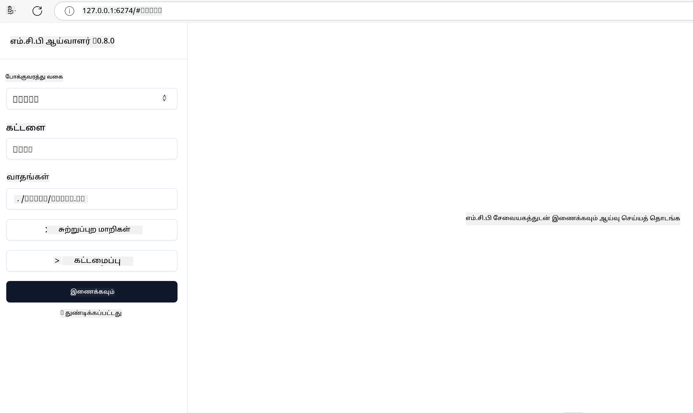

<!--
CO_OP_TRANSLATOR_METADATA:
{
  "original_hash": "4e34e34e84f013e73c7eaa6d09884756",
  "translation_date": "2025-10-11T11:56:44+00:00",
  "source_file": "03-GettingStarted/08-testing/README.md",
  "language_code": "ta"
}
-->
## சோதனை மற்றும் பிழைதிருத்தம்

உங்கள் MCP சர்வரை சோதனை செய்யத் தொடங்குவதற்கு முன், பிழைதிருத்தத்திற்கான கிடைக்கக்கூடிய கருவிகள் மற்றும் சிறந்த நடைமுறைகளைப் புரிந்துகொள்வது முக்கியம். பயனுள்ள சோதனை உங்கள் சர்வர் எதிர்பார்த்தபடி செயல்படுவதை உறுதிப்படுத்துகிறது மற்றும் பிரச்சினைகளை விரைவாக அடையாளம் காணவும் தீர்க்கவும் உதவுகிறது. கீழே உள்ள பகுதி உங்கள் MCP செயல்பாட்டை சரிபார்க்க பரிந்துரைக்கப்பட்ட அணுகுமுறைகளை விளக்குகிறது.

## மேற்பார்வை

இந்த பாடம் சரியான சோதனை அணுகுமுறையைத் தேர்ந்தெடுப்பது மற்றும் மிகவும் பயனுள்ள சோதனை கருவியைப் பயன்படுத்துவது குறித்து கற்றுக்கொள்கிறது.

## கற்றல் நோக்கங்கள்

இந்த பாடத்தின் முடிவில், நீங்கள்:

- சோதனைக்கு பல்வேறு அணுகுமுறைகளை விவரிக்க முடியும்.
- உங்கள் கோடுகளை பயனுள்ளதாக சோதிக்க பல்வேறு கருவிகளைப் பயன்படுத்த முடியும்.

## MCP சர்வர்களை சோதனை செய்வது

MCP உங்கள் சர்வர்களை சோதிக்கவும் பிழைதிருத்தவும் உதவும் கருவிகளை வழங்குகிறது:

- **MCP Inspector**: இது ஒரு கட்டளைகள் வரிசை (CLI) கருவியாகவும், காட்சிப்படுத்தும் கருவியாகவும் இயக்கப்படக்கூடியது.
- **கையேடு சோதனை**: curl போன்ற கருவியைப் பயன்படுத்தி வலை கோரிக்கைகளை இயக்கலாம், ஆனால் HTTP இயக்குவதற்கு ஏற்ற எந்த கருவியும் பயன்படும்.
- **Unit Testing**: சர்வர் மற்றும் கிளையன்ட் அம்சங்களை சோதிக்க உங்கள் விருப்பமான சோதனை கட்டமைப்பை பயன்படுத்தலாம்.

### MCP Inspector பயன்படுத்துவது

இந்த கருவியின் பயன்பாட்டை முந்தைய பாடங்களில் விவரித்துள்ளோம், ஆனால் இப்போது அதை ஒரு மேல் நிலை பார்வையில் பேசுவோம். இது Node.js-ல் உருவாக்கப்பட்ட ஒரு கருவி, மற்றும் `npx` செயல்பாட்டை அழைப்பதன் மூலம் நீங்கள் இதைப் பயன்படுத்தலாம். இது கருவியை தற்காலிகமாக பதிவிறக்கம் செய்து நிறுவும், மற்றும் உங்கள் கோரிக்கையை இயக்கி முடித்தவுடன் தானாகவே துப்புரவு செய்யும்.

[MCP Inspector](https://github.com/modelcontextprotocol/inspector) உங்களுக்கு உதவுகிறது:

- **சர்வர் திறன்களை கண்டறிதல்**: கிடைக்கக்கூடிய வளங்கள், கருவிகள் மற்றும் உந்துதல்களை தானாகவே கண்டறிதல்.
- **கருவி செயல்பாட்டை சோதனை**: பல்வேறு அளவுருக்களை முயற்சித்து நேரடி பதில்களைப் பார்க்க.
- **சர்வர் மெட்டாடேட்டாவை பார்க்க**: சர்வர் தகவல்கள், ஸ்கீமாக்கள் மற்றும் கட்டமைப்புகளை ஆய்வு செய்ய.

கருவியின் ஒரு சாதாரண இயக்கம் இவ்வாறு இருக்கும்:

```bash
npx @modelcontextprotocol/inspector node build/index.js
```

மேலே உள்ள கட்டளை MCP மற்றும் அதன் காட்சிப்படுத்தும் இடைமுகத்தை தொடங்குகிறது மற்றும் உங்கள் உலாவியில் உள்ளூர் வலை இடைமுகத்தை தொடங்குகிறது. நீங்கள் MCP சர்வர்கள், அவற்றின் கிடைக்கக்கூடிய கருவிகள், வளங்கள் மற்றும் உந்துதல்களை காட்டும் ஒரு டாஷ்போர்டை காணலாம். இந்த இடைமுகம் உங்களுக்கு கருவி செயல்பாட்டை இடைமுகமாக சோதிக்க, சர்வர் மெட்டாடேட்டாவை ஆய்வு செய்ய மற்றும் நேரடி பதில்களைப் பார்க்க உதவுகிறது, இது MCP சர்வர் செயல்பாடுகளை சரிபார்க்கவும் பிழைதிருத்தவும் எளிதாக்குகிறது.

இது எப்படி தோன்றும்: 

இந்த கருவியை CLI முறையில் இயக்கவும் முடியும், அப்போது நீங்கள் `--cli` பண்பைச் சேர்க்க வேண்டும். "CLI" முறையில் கருவியை இயக்குவதற்கான உதாரணம் இதோ:

```sh
npx @modelcontextprotocol/inspector --cli node build/index.js --method tools/list
```

### கையேடு சோதனை

சர்வர் திறன்களை சோதிக்க Inspector கருவியை இயக்குவதற்கு மாறாக, HTTP பயன்படுத்தக்கூடிய கிளையன்டை இயக்குவது போன்ற ஒரு அணுகுமுறையும் உள்ளது, உதாரணமாக curl.

curl மூலம், MCP சர்வர்களை HTTP கோரிக்கைகளைப் பயன்படுத்தி நேரடியாக சோதிக்கலாம்:

```bash
# Example: Test server metadata
curl http://localhost:3000/v1/metadata

# Example: Execute a tool
curl -X POST http://localhost:3000/v1/tools/execute \
  -H "Content-Type: application/json" \
  -d '{"name": "calculator", "parameters": {"expression": "2+2"}}'
```

மேலே உள்ள curl பயன்பாட்டில், நீங்கள் கருவியின் பெயர் மற்றும் அதன் அளவுருக்களை உள்ளடக்கிய payload-ஐப் பயன்படுத்தி POST கோரிக்கையைச் செய்கிறீர்கள். உங்களுக்கு ஏற்ற அணுகுமுறையைப் பயன்படுத்தவும். CLI கருவிகள் பொதுவாக வேகமாக செயல்படுகின்றன மற்றும் அவற்றை ஸ்கிரிப்ட் செய்ய முடியும், இது CI/CD சூழலில் பயனுள்ளதாக இருக்கும்.

### Unit Testing

உங்கள் கருவிகள் மற்றும் வளங்கள் எதிர்பார்த்தபடி செயல்படுவதை உறுதிப்படுத்த Unit Tests உருவாக்கவும். சில சோதனை கோடுகளின் உதாரணம் இதோ:

```python
import pytest

from mcp.server.fastmcp import FastMCP
from mcp.shared.memory import (
    create_connected_server_and_client_session as create_session,
)

# Mark the whole module for async tests
pytestmark = pytest.mark.anyio


async def test_list_tools_cursor_parameter():
    """Test that the cursor parameter is accepted for list_tools.

    Note: FastMCP doesn't currently implement pagination, so this test
    only verifies that the cursor parameter is accepted by the client.
    """

 server = FastMCP("test")

    # Create a couple of test tools
    @server.tool(name="test_tool_1")
    async def test_tool_1() -> str:
        """First test tool"""
        return "Result 1"

    @server.tool(name="test_tool_2")
    async def test_tool_2() -> str:
        """Second test tool"""
        return "Result 2"

    async with create_session(server._mcp_server) as client_session:
        # Test without cursor parameter (omitted)
        result1 = await client_session.list_tools()
        assert len(result1.tools) == 2

        # Test with cursor=None
        result2 = await client_session.list_tools(cursor=None)
        assert len(result2.tools) == 2

        # Test with cursor as string
        result3 = await client_session.list_tools(cursor="some_cursor_value")
        assert len(result3.tools) == 2

        # Test with empty string cursor
        result4 = await client_session.list_tools(cursor="")
        assert len(result4.tools) == 2
    
```

மேலே உள்ள கோடு இதைச் செய்கிறது:

- pytest கட்டமைப்பைப் பயன்படுத்துகிறது, இது சோதனைகளை செயல்பாடுகளாக உருவாக்கவும் assert அறிக்கைகளைப் பயன்படுத்தவும் அனுமதிக்கிறது.
- இரண்டு வெவ்வேறு கருவிகளுடன் MCP சர்வரை உருவாக்குகிறது.
- `assert` அறிக்கையைப் பயன்படுத்தி குறிப்பிட்ட நிலைகள் பூர்த்தி செய்யப்படுகிறதா என்பதைச் சரிபார்க்கிறது.

முழு கோப்பைப் பார்க்க [இங்கே](https://github.com/modelcontextprotocol/python-sdk/blob/main/tests/client/test_list_methods_cursor.py)

மேலே உள்ள கோப்பை வைத்து, உங்கள் சொந்த சர்வரை சோதனை செய்து திறன்கள் எதிர்பார்த்தபடி உருவாக்கப்படுகிறதா என்பதை உறுதிப்படுத்தலாம்.

அனைத்து முக்கிய SDKகளிலும் இதே போன்ற சோதனை பிரிவுகள் உள்ளன, எனவே நீங்கள் உங்கள் தேர்ந்த runtime-க்கு ஏற்ப மாற்றலாம்.

## உதாரணங்கள் 

- [Java Calculator](../samples/java/calculator/README.md)
- [.Net Calculator](../../../../03-GettingStarted/samples/csharp)
- [JavaScript Calculator](../samples/javascript/README.md)
- [TypeScript Calculator](../samples/typescript/README.md)
- [Python Calculator](../../../../03-GettingStarted/samples/python) 

## கூடுதல் வளங்கள்

- [Python SDK](https://github.com/modelcontextprotocol/python-sdk)

## அடுத்தது என்ன?

- அடுத்தது: [Deployment](../09-deployment/README.md)

---

**குறிப்பு**:  
இந்த ஆவணம் [Co-op Translator](https://github.com/Azure/co-op-translator) என்ற AI மொழிபெயர்ப்பு சேவையைப் பயன்படுத்தி மொழிபெயர்க்கப்பட்டுள்ளது. நாங்கள் துல்லியத்திற்காக முயற்சிக்கின்றோம், ஆனால் தானியங்கி மொழிபெயர்ப்புகளில் பிழைகள் அல்லது தவறான தகவல்கள் இருக்கக்கூடும் என்பதை கவனத்தில் கொள்ளவும். அதன் தாய்மொழியில் உள்ள மூல ஆவணம் அதிகாரப்பூர்வ ஆதாரமாக கருதப்பட வேண்டும். முக்கியமான தகவல்களுக்கு, தொழில்முறை மனித மொழிபெயர்ப்பு பரிந்துரைக்கப்படுகிறது. இந்த மொழிபெயர்ப்பைப் பயன்படுத்துவதால் ஏற்படும் எந்த தவறான புரிதல்கள் அல்லது தவறான விளக்கங்களுக்கு நாங்கள் பொறுப்பல்ல.